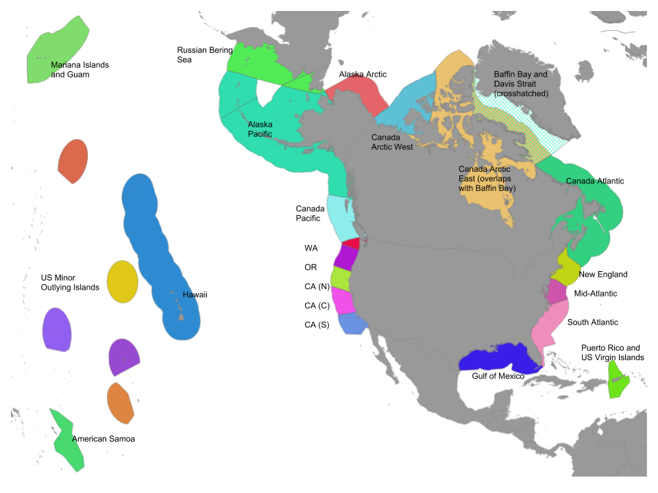

```{r setup, include=FALSE, message=F,warning=F}
knitr::opts_chunk$set(message=F,warning=F, fig.width = 14, fig.height = 12)

options(scipen = 999,
        digits = 4)

library(rgdal)
library(tidyverse)
library(stringr)
library(raster)
library(data.table)
library(purrr)
library(rgeos)
library(parallel)
library(tmap)
library(RColorBrewer)

wgs_crs <- CRS("+proj=longlat +datum=WGS84 +no_defs +ellps=WGS84 +towgs84=0,0,0")

# set the mazu data_edit share based on operating system
dir_M             <- c('Windows' = '//mazu.nceas.ucsb.edu/ohi',
                       'Darwin'  = '/Volumes/ohi',    ### connect (cmd-K) to smb://mazu/ohi
                       'Linux'   = '/home/shares/ohi')[[ Sys.info()[['sysname']] ]]

# ocean = raster(file.path(dir_M,'model/GL-NCEAS-Halpern2008/tmp/ocean.tif'))%>%
#           crop(.,extent(-18040095,18040134,-2333936,9335794))

#writeRaster(ocean,filename = file.path(dir_M,'git-annex/mci-report/ocean_half.tif'),overwrite=T)

ocean = raster(file.path(dir_M,'git-annex/mci-report/ocean_half.tif'))

```

```{r rgn_shapefiles}

bc  = readOGR('shapefiles','ohibc_rgn', verbose = F)%>%
      spTransform(CRS("+proj=moll +lon_0=0 +x_0=0 +y_0=0 +ellps=WGS84 +units=m +no_defs"))
ne  = readOGR('shapefiles','ohine_rgn', verbose = F)%>%
      spTransform(CRS("+proj=moll +lon_0=0 +x_0=0 +y_0=0 +ellps=WGS84 +units=m +no_defs"))

#baffin bay and davis strait
bbds_map <- readOGR(file.path(dir_M,'git-annex/mci-report/shapefiles'),'baffin', verbose = F)

bbds <- spTransform(bbds_map,CRS("+proj=moll +lon_0=0 +x_0=0 +y_0=0 +ellps=WGS84 +units=m +no_defs"))
bbds@data <- bbds@data%>%dplyr::select(-id)

mci_rgns = readOGR(dsn = file.path(dir_M,'git-annex/mci-report/shapefiles'),layer = 'mci_rgns', verbose=F)%>%
    spTransform(CRS("+proj=moll +lon_0=0 +x_0=0 +y_0=0 +ellps=WGS84 +units=m +no_defs"))
mci_rgns@data <- mci_rgns@data%>%dplyr::select(-ohi_rgn)

mci_rgns = rbind(mci_rgns,bbds)

if(!file.exists(file.path(dir_M,"git-annex/mci-report/three_nm.tif"))){

#3nm shapefile to use when clipping coastal pressures
threenm <- readOGR(dsn = file.path(dir_M,'git-annex/globalprep/spatial/d2014/data'),layer = 'regions_offshore3nm_mol')

#remove all polygons outside of our regions
t <- threenm[as.character(threenm@data$rgn_name) %in% c(as.character(mci_rgns@data$rgn_nam),"United States","Russia","Canada","Greenland"),]

#rasterize to use for masking (I think this is faster than masking with shapefile)
three_ras <- rasterize(t,ocean,t@data$sp_id,progress='text', filename = file.path(dir_M,'git-annex/mci-report/three_nm.tif'),overwrite=T)
}


three_ras <- raster(file.path(dir_M,'git-annex/mci-report/three_nm.tif'))
three_ras_bc <- crop(three_ras,bc)%>%mask(bc)
three_ras_ne <- crop(three_ras,ne)%>%mask(ne)
#three_ras_gd <- crop(three_ras,bbds)%>%mask(bbds)

```

```{r chi_data}

#read in from Mazu location: marine_threats/impact_layers_2013_redo/global_impact_model_2013/normalized_by_two_time_periods/averaged_by_num_ecosystems/by_threat

new_layers <- list.files(file.path(dir_M,'marine_threats/impact_layers_2013_redo/global_impact_model_2013/normalized_by_two_time_periods/averaged_by_num_ecosystems/by_threat'),full.names=T, pattern = '.tif$')[c(1:12,14,15)]

#shipping, invasives, ocean pollution and sea level rise
old_layers <- list.files(file.path(dir_M,'marine_threats/impact_layers_2013_redo/global_impact_model_2013/normalized_by_one_time_period/averaged_by_num_ecosystems/by_threat'),full.names=T, pattern = '.tif$')[c(6,9,16,17)]


layers = c(new_layers,old_layers)

```

# Regions



```{r extract_data_for_regions}

getvals <- function(layer){
  
    if(basename(layer) %in% c("artisanal_fishing_combo.tif","inorganic_combo.tif","plumes_fert_combo.tif","plumes_pest_combo.tif","slr_combo.tif")){
      
       vals = raster(layer)%>%
              crop(three_ras)%>%
              mask(three_ras)%>%
              raster::extract(mci_rgns,method = 'simple',progress='text')%>%
              setNames(mci_rgns@data$rgn_nam)
      
    }else{
      
       vals = raster(layer)%>%
              crop(ocean)%>%
              raster::extract(mci_rgns,method = 'simple',progress='text')%>%
              setNames(mci_rgns@data$rgn_nam)
    }  
return(vals)
}

#check to see if file exists.
if(!file.exists(file.path(dir_M,"git-annex/mci-report/rgn_prs_values.RData"))){

  #list of all values within each region for each pressure
mci_prs_vals <- mclapply(layers,getvals,mc.cores=18)%>%
               setNames(basename(layers))%>%
               setNames(str_replace(names(.),"_combo.tif",""))

  save(mci_prs_vals, file=file.path(dir_M,"git-annex/mci-report/rgn_prs_values.RData"))
}
  #vals is the list, let's try to use map to calculate mean, max
  
  load(file.path(dir_M,"git-annex/mci-report/rgn_prs_values.RData"))
```


```{r}

quant_func <- function(layer){
  
    vec<-unlist(layer)
    q = quantile(vec,probs = c(0.025,0.25,0.5,0.75,0.975),na.rm=T)
    
    return(q)
}


```


```{r, quantify_area_in_cats}

if(!file.exists("mci-rgns-data.csv")){
  
#quants is a list of length 12, one for each pressure layer. Each layer has 5 quantiles
quants = map(mci_prs_vals,quant_func)
q = quants%>%
      as.data.frame()%>%
          t()%>%
          as.data.frame()%>%
          tibble::rownames_to_column()%>%
          mutate(pressure = str_replace(rowname,'_combo.tif',""))%>%
          rename(verylow = `2.5%`,
                 low     = `25%`,
                 medium  = `50%`,
                 high    = `75%`,
                 veryhigh = `97.5%`)%>%
          dplyr::select(pressure, verylow, low, medium, high, veryhigh)

df = data.frame()

for (i in 1:length(layers)){
   
     #get the pressure name
     for (j in 1:28){
       
     pres_name = names(mci_prs_vals[i])
     region   = names(mci_prs_vals[[i]])[j]
     
     #select the values
      m = mci_prs_vals[[pres_name]][[j]]
      m = m[!is.na(m)]

      h = filter(q,pressure == pres_name)
  
   n <- c(length(m[m<=h$verylow]),
          length(m[m<=h$low & m>h$verylow]),
          length(m[m<=h$high & m>h$low]),
          length(m[m<=h$veryhigh & m>h$high]),
          length(m[m>h$veryhigh]))
   
   d = data.frame(n)%>%
        mutate(perc = round(n/length(m),3),
               cat = c("verylow","low","medium","high","veryhigh"),
               brk = c(0,2.5,25,75,97.5), #assigning breaks for plotting later
               pressure = pres_name,
               rgn = region,
               mean = round(mean(m,na.rm=T),3),
               max = round(max(m,na.rm=T),3),
               total = round(sum(m,na.rm=T),3))
     
    df = rbind(df,d) 
     }
 }

write_csv(df,path = 'mci-rgns-data.csv')
}else{
  df = read_csv('mci-rgns-data.csv')
}


```

### Proportional area and impact of stressors across all regions

```{r regions, fig.width = 16, fig.height = 16}

pres_names <- read_csv('pressure_names.csv')

df = df%>%left_join(pres_names,by='pressure')%>%
      mutate(rgn = ifelse(rgn == "United States Oregon", "Oregon",
                   ifelse(rgn == "United States Central California","Central California",
                   ifelse(rgn == "United States Washington", "Washington",
                   ifelse(rgn == "United States New England","US Northeast",
                   ifelse(rgn == "United States Gulf of Mexico","Gulf of Mexico",
                   ifelse(rgn == "United States Alaska Arctic","Alaska Arctic",
                   ifelse(rgn == "Puerto Rico and Virgin Islands of the United States","Puerto Rico & US Virgin Islands",
                   ifelse(rgn == "United States Hawaii","Hawaii",
                   ifelse(rgn == "United States Northern California","Northern California",
                   ifelse(rgn == "United States Southern California","Southern California",
                   ifelse(rgn == "United States South Atlantic","South Atlantic",
                   ifelse(rgn == "United States Alaska Pacific","Alaska Pacific",
                   ifelse(rgn == "United States Mid Atlantic","Mid-Atlantic",
                   ifelse(rgn == "United States West Coast","West Coast",
                   ifelse(rgn == "United States Mid-North East Coast","Mid-Atl. & Northeast",rgn))))))))))))))))%>%
      mutate(rgn_wrap = str_wrap(rgn, width = 20),
             displayName_w = str_wrap(displayName,width = 30),
             perc = perc*100)

#by pressure
df$cat <- factor(df$cat, levels = rev(c("verylow","low","medium","high","veryhigh")))

#climate change
cc<- df%>%filter(pressure %in% c('sst','uv','ocean_acidification','slr'))
cc$displayName = factor(cc$displayName,levels = c('Ocean Acidification','Sea Surface Temperature','Sea Level Rise','Ultraviolet Radiation'))                                     
 
#pollution + shipping
pol <- df%>%filter(pressure %in% c('inorganic','plumes_fert','plumes_pest','ocean_pollution','shipping','invasives','oil_rigs','night_lights'))
pol$displayName = factor(pol$displayName, levels=c('Inorganic Pollution','Organic Pollution','Nutrient Pollution','Ocean Pollution','Shipping','Invasive Species','Oil Rigs','Night Lights'))

#fisheries
fis <- df%>%filter(pressure %in% c('artisanal_fishing','demersal_destructive_fishing','demersal_nondest_high_bycatch','demersal_nondest_low_bycatch',
                                   'pelagic_low_bycatch','pelagic_high_bycatch'))

# function to plot each of the datasets 
perc_plot <- function(data){ 
  ggplot(data) + 
    geom_bar(aes(x = rgn,y = perc,fill = factor(cat)),position = 'stack',stat = 'identity', alpha = 1) +
  scale_fill_manual(values = c('verylow' = '#4dac26',
                               'low' = '#b8e186', 
                               'medium' = '#f1b6da',
                               'high' = '#d01c8b',
                               'veryhigh'='#67001f'),
                     name = "Category",
                     labels = c("verylow","low","medium","high","veryhigh",
                    guide = guide_legend(reverse = TRUE))) +
    coord_flip()+
  labs(y = "Percent of region's area")+
  facet_wrap(~displayName_w)+
  theme(text = element_text(size = 16),
        axis.title.y=element_blank(),
        axis.text=element_text(size=14),
        legend.text=element_text(size=16))
}

perc_plot(cc)
perc_plot(pol)
perc_plot(fis)
```

```{r mci_rgns datatable}
#create small dataframe that assigns each pressure a short name for display purposes
s <- data.frame(pressure = unique(df$pressure),
                short    = c("art","ddf","dnd-hb","dnd-lb","inorganic","lights","oa","oil","pel-hb","pel-lb","fert","pest","sst","uv","invasives","ocean_poll","ship","slr"))

df_dt = df%>%
        mutate(shortname = s$short[match(pressure,s$pressure)])%>%
        dplyr::select(perc,cat,rgn,shortname)

DT::datatable(df_dt)

```

```{r avg_impact}

#select just the mean impact score per pressure/region
avg <- df%>%
       dplyr::select(pressure,rgn,rgn_wrap,mean,displayName)%>%
        unique()

#expand color palette
colourCount = length(unique(avg$pressure))
getPalette = colorRampPalette(brewer.pal(9, "Set1"))

#plot the mean impact per pressure layer per region in a stacked bar chart
ggplot(avg) + geom_bar(aes(y = mean, x = reorder(rgn_wrap,-mean),fill = factor(displayName)), stat = "identity")+
  theme(axis.text.x = element_text(angle = 70, hjust = 1))+
  labs(x = "Region",
       y = "Mean Impact Score",
       title = "All Pressures") + 
  scale_fill_manual("Pressure",values = getPalette(colourCount))+
  theme(text = element_text(size = 14),
        axis.text=element_text(size=14),
        legend.justification = c(1, 1), 
        legend.position = c(1, 1))+
  guides(fill=guide_legend(ncol=2))+ylim(0,6)

#plot the same but without climate stressors
climate  = c("sst","uv","ocean_acidification","slr")
avg_noclim <- avg%>%
                filter(!pressure%in% climate)

ggplot(avg_noclim) + geom_bar(aes(y = mean, x = reorder(rgn_wrap,-mean), fill = factor(displayName)), stat = "identity")+
  theme(axis.text.x = element_text(angle = 70, hjust = 1))+
  labs(x = "Region",
       y = "Mean Impact Score",
       title = "Without climate pressures") + 
  scale_fill_manual("Pressure",values = getPalette(colourCount))+
  theme(text = element_text(size = 14),
        axis.text=element_text(size=14),
        legend.justification = c(1, 1), 
        legend.position = c(1, 1))+
  guides(fill=guide_legend(ncol=2))

```

```{r datatable}

avg_dt = avg%>%
        mutate(shortname = s$short[match(pressure,s$pressure)])%>%
        dplyr::select(-pressure,-displayName,-rgn_wrap)%>%
        spread(shortname,mean)

DT::datatable(avg_dt)

```


***

# British Columbia


```{r plot_bc_rgns}
library(tmap)
bc_map <- readOGR('shapefiles','ohibc_rgn', verbose = F)

tm_shape(bc_map)+
  tm_polygons(col = 'rgn_name',
              title = 'Regions',
              palette = 'Set2')+
tm_legend(text.size=1.5,
    title.size=1.5)

```

```{r get_bc_vals}

get_bc_vals <- function(layer){
  
    if(basename(layer) %in% c("artisanal_fishing_combo.tif","inorganic_combo.tif","plumes_fert_combo.tif","plumes_pest_combo.tif","slr_combo.tif")){
      
       vals = raster(layer)%>%
              crop(three_ras_bc)%>%
              mask(three_ras_bc)%>%
              raster::extract(bc,method = 'simple',progress='text')%>%
              setNames(bc@data$rgn_nam)
      
    }else{
      
        vals = raster(layer)%>%
              crop(bc)%>%
              raster::extract(bc,method = 'simple',progress='text')%>%
              setNames(bc@data$rgn_nam)
    }  
return(vals)
}


#check to see if file exists.
if(!file.exists(file.path(dir_M,"git-annex/mci-report/bc_prs_values.RData"))){

  #list of all values within each region for each pressure
bc_prs_vals <- mclapply(layers,get_bc_vals,mc.cores=18)%>%
               setNames(basename(layers))%>%
               setNames(str_replace(names(.),"_combo.tif",""))

  save(bc_prs_vals, file=file.path(dir_M,"git-annex/mci-report/bc_prs_values.RData"))
}
  #vals is the list, let's try to use map to calculate mean, max
  
  load(file.path(dir_M,"git-annex/mci-report/bc_prs_values.RData"))

```


```{r}

#quants is a list of length 12, one for each pressure layer. Each layer has 5 quantiles
bc_quants = map(bc_prs_vals,quant_func)
q = bc_quants%>%
      as.data.frame()%>%
          t()%>%
          as.data.frame()%>%
          tibble::rownames_to_column()%>%
          mutate(pressure = str_replace(rowname,'_combo.tif',""))%>%
          rename(verylow = `2.5%`,
                 low     = `25%`,
                 medium  = `50%`,
                 high    = `75%`,
                 veryhigh = `97.5%`)%>%
          dplyr::select(pressure, verylow, low, medium, high, veryhigh)

```

### Proportional area and impact of stressors in British Columbia
```{r}

df = data.frame()

for (i in 1:length(layers)){
   
     #get the pressure name
     for (j in 1:7){
       
     pres_name = names(bc_prs_vals[i])
     region   = names(bc_prs_vals[[i]])[j]
     
     #select the values
      m = bc_prs_vals[[pres_name]][[j]]
      m = m[!is.na(m)]

      h = filter(q,pressure == pres_name)
  
   n <- c(length(m[m<=h$verylow]),
          length(m[m<=h$low & m>h$verylow]),
          length(m[m<=h$high & m>h$low]),
          length(m[m<=h$veryhigh & m>h$high]),
          length(m[m>h$veryhigh]))
   
   d = data.frame(n)%>%
        mutate(perc = round(n/length(m),3),
               cat = c("verylow","low","medium","high","veryhigh"),
               brk = c(0,2.5,25,75,97.5), #assigning breaks for plotting later
               pressure = pres_name,
               rgn = region,
               mean = round(mean(m,na.rm=T),3),
               max = round(max(m,na.rm=T),3),
               total = round(sum(m,na.rm=T),3))
     
    df = rbind(df,d) 
     }
 }

```


```{r}

df = df%>%
      left_join(pres_names,by='pressure')%>%
      mutate(rgn_wrap = str_wrap(rgn, width = 20),
             displayName_w = str_wrap(displayName,width = 30))

#by pressure
df$cat <- factor(df$cat, levels = rev(c("verylow","low","medium","high","veryhigh")))

#climate change
cc<- df%>%filter(pressure %in% c('sst','uv','ocean_acidification','slr'))
cc$displayName = factor(cc$displayName,levels = c('Ocean Acidification','Sea Surface Temperature','Sea Level Rise','Ultraviolet Radiation'))                                     
 
#pollution + shipping
pol <- df%>%filter(pressure %in% c('inorganic','plumes_fert','plumes_pest','ocean_pollution','shipping','invasives','oil_rigs','night_lights'))
pol$displayName = factor(pol$displayName, levels=c('Inorganic Pollution','Organic Pollution','Nutrient Pollution','Ocean Pollution','Shipping','Invasive Species','Oil Rigs','Night Lights'))

#fisheries
fis <- df%>%filter(pressure %in% c('artisanal_fishing','demersal_destructive_fishing','demersal_nondest_high_bycatch','demersal_nondest_low_bycatch',
                                   'pelagic_low_bycatch','pelagic_high_bycatch'))
  

perc_plot(cc)
perc_plot(pol)
perc_plot(fis)

```

```{r bc datatable}

df_dt = df%>%
        mutate(shortname = s$short[match(pressure,s$pressure)])%>%
        dplyr::select(perc,cat,rgn,shortname)

DT::datatable(df_dt)

```

```{r, fig.width=12,fig.height=8}

#get the mean impact per region per pressure
avg <- df%>%
       dplyr::select(pressure,rgn_wrap,mean,displayName)%>%
        unique()

#get the total impact due to fishing (add mean impact per fishing pressure layer)
fis_avg <- avg%>%
            filter(pressure %in% c('artisanal_fishing','demersal_destructive_fishing',
                                        'demersal_nondest_high_bycatch','demersal_nondest_low_bycatch',
                                        'pelagic_low_bycatch','pelagic_high_bycatch'))%>%
            group_by(rgn_wrap)%>%
            summarise(mean = sum(mean))%>%
            ungroup()%>%
            mutate(pressure = "fishing",
                   displayName = "Fishing")

#remove all individual fishing layers
avg <- rbind(avg,fis_avg)%>%
        filter(!pressure %in% c('artisanal_fishing','demersal_destructive_fishing',
                                        'demersal_nondest_high_bycatch','demersal_nondest_low_bycatch',
                                        'pelagic_low_bycatch','pelagic_high_bycatch'))

#plot the mean impact of each stressor layer per region
ggplot(avg) + geom_bar(aes(y = mean, x = reorder(rgn_wrap,-mean),fill = factor(displayName)), stat = "identity")+
  theme(axis.text.x = element_text(angle = 45, hjust = 1))+
  labs(x = "Region",
       y = "Mean Impact Score",
       title = "All pressures") + 
  scale_fill_manual("Pressure",values = getPalette(colourCount))+
  theme(text = element_text(size = 12),
        axis.text=element_text(size=12),
        legend.justification = c(1, 1), 
        legend.position = c(1, 1),
        legend.text=element_text(size=10))+
  guides(fill=guide_legend(ncol=2))+ylim(0,4.5)

#same plot but without climate pressures

avg_noclim <- avg%>%
                filter(!pressure%in% climate)

ggplot(avg_noclim) + geom_bar(aes(y = mean, x = reorder(rgn_wrap,-mean),fill = factor(displayName)), stat = "identity")+
  theme(axis.text.x = element_text(angle = 45, hjust = 1))+
  labs(x = "Region",
       y = "Mean Impact Score",
       title = "Without climate pressures") + 
  scale_fill_manual("Pressure",values = getPalette(colourCount))+
 theme(text = element_text(size = 12),
        axis.text=element_text(size=12),
        legend.justification = c(1, 1), 
        legend.position = c(1, 1),
        legend.text=element_text(size=10))


```

```{r}

avg <- df%>%
        mutate(shortname = s$short[match(pressure,s$pressure)])%>%
       dplyr::select(shortname,rgn,mean)%>%
        unique()%>%
        spread(shortname,mean)

DT::datatable(avg)

```

***

# Northeast

```{r}

ne_map <- readOGR('shapefiles','ohine_rgn', verbose = F)

tm_shape(ne_map)+
  tm_polygons(col = 'rgn_name',
              title = 'Regions',
              palette = 'Set2')+
tm_legend(text.size=1.5,
    title.size=1.5,
    position = c("left","top"))


```


```{r get_ne_vals}

get_ne_vals <- function(layer){
  
    if(basename(layer) %in% c("artisanal_fishing_combo.tif","inorganic_combo.tif","plumes_fert_combo.tif","plumes_pest_combo.tif","slr.tif")){
      
       vals = raster(layer)%>%
              crop(three_ras_ne)%>%
              mask(three_ras_ne)%>%
              raster::extract(ne,method = 'simple',progress='text')%>%
              setNames(ne@data$rgn_nam)
      
    }else{
      
        vals = raster(layer)%>%
              crop(ne)%>%
              raster::extract(ne,method = 'simple',progress='text')%>%
              setNames(ne@data$rgn_nam)
    }  
return(vals)
}


#check to see if file exists.
if(!file.exists(file.path(dir_M,"git-annex/mci-report/ne_prs_values.RData"))){

  #list of all values within each region for each pressure
ne_prs_vals <- mclapply(layers,get_ne_vals,mc.cores=18)%>%
               setNames(basename(layers))%>%
               setNames(str_replace(names(.),"_combo.tif",""))

  save(ne_prs_vals, file=file.path(dir_M,"git-annex/mci-report/ne_prs_values.RData"))
}
  #vals is the list, let's try to use map to calculate mean, max
  
  load(file.path(dir_M,"git-annex/mci-report/ne_prs_values.RData"))

```


```{r}

#quants is a list of length 18, one for each pressure layer. Each layer has 5 quantiles
ne_quants = map(ne_prs_vals,quant_func)
q = ne_quants%>%
      as.data.frame()%>%
          t()%>%
          as.data.frame()%>%
          tibble::rownames_to_column()%>%
          mutate(pressure = str_replace(rowname,'_combo.tif',""))%>%
          rename(verylow = `2.5%`,
                 low     = `25%`,
                 medium  = `50%`,
                 high    = `75%`,
                 veryhigh = `97.5%`)%>%
          dplyr::select(pressure, verylow, low, medium, high, veryhigh)

```

### Proportional area and impact of stressors in the Northeast USA
```{r}

df = data.frame()

for (i in 1:length(layers)){
   
     #get the pressure name
     for (j in 1:9){
       
     pres_name = names(ne_prs_vals[i])
     region   = names(ne_prs_vals[[i]])[j]
     
     #select the values
      m = ne_prs_vals[[pres_name]][[j]]
      m = m[!is.na(m)]

      h = filter(q,pressure == pres_name)
  
   n <- c(length(m[m<=h$verylow]),
          length(m[m<=h$low & m>h$verylow]),
          length(m[m<=h$high & m>h$low]),
          length(m[m<=h$veryhigh & m>h$high]),
          length(m[m>h$veryhigh]))
   
   d = data.frame(n)%>%
        mutate(perc = round(n/length(m),3),
               cat = c("verylow","low","medium","high","veryhigh"),
               brk = c(0,2.5,25,75,97.5), #assigning breaks for plotting later
               pressure = pres_name,
               rgn = region,
               mean = round(mean(m,na.rm=T),3),
               max = round(max(m,na.rm=T),3),
               total = round(sum(m,na.rm=T),3))
     
    df = rbind(df,d) 
     }
 }

```


```{r}

df = df%>%
      left_join(pres_names,by='pressure')%>%
      mutate(rgn_wrap = str_wrap(rgn, width = 20),
             displayName_w = str_wrap(displayName,width = 30))

#by pressure
df$cat <- factor(df$cat, levels = rev(c("verylow","low","medium","high","veryhigh")))

#climate change
cc<- df%>%filter(pressure %in% c('sst','uv','ocean_acidification','slr'))
cc$displayName = factor(cc$displayName,levels = c('Ocean Acidification','Sea Surface Temperature','Sea Level Rise','Ultraviolet Radiation'))                                     
 
#pollution + shipping
pol <- df%>%filter(pressure %in% c('inorganic','plumes_fert','plumes_pest','ocean_pollution','shipping','invasives','oil_rigs','night_lights'))
pol$displayName = factor(pol$displayName, levels=c('Inorganic Pollution','Organic Pollution','Nutrient Pollution','Ocean Pollution','Shipping','Invasive Species','Oil Rigs','Night Lights'))

#fisheries
fis <- df%>%filter(pressure %in% c('artisanal_fishing','demersal_destructive_fishing','demersal_nondest_high_bycatch','demersal_nondest_low_bycatch',
                                   'pelagic_low_bycatch','pelagic_high_bycatch'))
  
perc_plot(cc)
perc_plot(pol)
perc_plot(fis)

```

```{r}

df_dt = df%>%
        mutate(shortname = s$short[match(pressure,s$pressure)])%>%
        dplyr::select(perc,cat,rgn,shortname)

DT::datatable(df_dt)

```

```{r, fig.width = 10, fig.height = 8}

avg <- df%>%
       dplyr::select(pressure,rgn,mean,displayName)%>%
        unique()

#plot the mean impact of each pressure layer in a stacked bar chart
ggplot(avg) + geom_bar(aes(y = mean, x = reorder(rgn,-mean),fill = factor(displayName)), stat = "identity")+
  theme(axis.text.x = element_text(angle = 45, hjust = 1))+
  labs(x = "Region",
       y = "Mean Impact Score",
       title = "All pressures") + 
  scale_fill_manual("Pressure",values = getPalette(colourCount))+
  theme(text = element_text(size = 12),
        axis.text=element_text(size=12),
        legend.justification = c(1, 1), 
        legend.position = c(1, 1),
        legend.text=element_text(size=8))+
  guides(fill=guide_legend(ncol=2))+ ylim(0, 7.5)

#do the same but without climate pressures

avg_noclim <- avg%>%
                filter(!pressure%in% climate)

ggplot(avg_noclim) + geom_bar(aes(y = mean, x = reorder(rgn,-mean),fill = factor(displayName)), stat = "identity")+
  theme(axis.text.x = element_text(angle = 45, hjust = 1))+
  labs(x = "Region",
       y = "Mean Impact Score",
       title = "Without climate pressures") + 
  scale_fill_manual("Pressure",values = getPalette(colourCount))+
  theme(text = element_text(size = 12),
        axis.text=element_text(size=12),
        legend.justification = c(1, 1), 
        legend.position = c(1, 1),
        legend.text=element_text(size=8))+
  guides(fill=guide_legend(ncol=2))+ ylim(0, 3)

```

```{r}

avg <- df%>%
        mutate(shortname = s$short[match(pressure,s$pressure)])%>%
       dplyr::select(shortname,rgn,mean)%>%
        unique()%>%
        spread(shortname,mean)

DT::datatable(avg)

```
